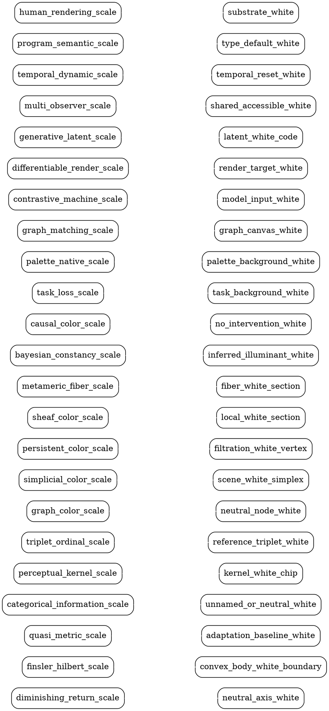

# Non-Riemannian Color Scales

This is a mini-reference for extending `GayLearnableColor.jl` beyond one
Riemannian-looking perceptual embedding. The common shape is:

```text
source -> structural scale -> learnable embedding -> perceptual renderer -> check
```

A color scale here is not just a coordinate system. It is a directed relation
among stimulus, observer, machine model, rendering substrate, task, and context.
Each scale below includes an explicit `white-link`. In this document, `white`
means the neutral/illuminant/context anchor of that scale, not a value judgment.

```text
white-link: <scale> -> white-anchor
```

The white anchor may be D65, display white, paper white, background white, an
adapted neutral point, a maximum-entropy state, or a task-defined "no signal"
state. The rule: every scale that refers to color must say how it points back
to its neutral reference.

## Scale Protocol

```julia
abstract type AbstractColorScale end
abstract type AbstractWhiteAnchor end

source(scale)       # what generates samples or comparisons
carrier(scale)      # points, graph nodes, distributions, programs, actions
compare(scale, a,b) # distance, divergence, order, triplet, loss, or relation
render(scale, x)    # human/machine visible color or artifact
white_anchor(scale) # directed neutral reference
diagnose(scale)     # stress, corr, confusion, task loss, accessibility, etc.
```

## Twenty-Three Priority Classes

### 1. Diminishing-Return Color

- Core: large perceived differences are not sums of small just-noticeable steps.
- Scale extension: replace additive path length with a concave difference
  function, e.g. `D_large = f(D_local)` where `f` is subadditive.
- Learnable handle: fit `f` from human comparisons or machine discrimination
  curves.
- Counterfactual: if this scale is true, optimizing many tiny `Delta E` steps
  will overstate large palette separations.
- white-link: `diminishing_return_scale -> neutral_axis_white`.

### 2. Finsler / Hilbert Convex Color

- Core: local cost depends on direction, not only location.
- Scale extension: represent an observer gamut as a convex body; distance uses
  directional boundary intersections.
- Learnable handle: learn the convex reachable region for one observer, display,
  or model.
- Counterfactual: moving toward glare white and moving away from it can have
  different perceptual costs.
- white-link: `finsler_hilbert_scale -> convex_body_white_boundary`.

### 3. Quasi-Metric Adaptation Color

- Core: `compare(a,b) != compare(b,a)` because adaptation and memory create
  directed perception.
- Scale extension: store directed edges or asymmetric matrices.
- Learnable handle: learn from ordered before/after judgments, not unordered
  pairs.
- Counterfactual: a color may be easy to enter from neutral but hard to leave
  after saturation fatigue.
- white-link: `quasi_metric_scale -> adaptation_baseline_white`.

### 4. Categorical-Information Color

- Core: color is a distribution over names, labels, or concepts.
- Scale extension: compare colors by divergence between name distributions.
- Learnable handle: collect labels or infer names from logs, captions, or UI
  behavior.
- Counterfactual: two colors far in Lab may be near if both are called "blue."
- white-link: `categorical_information_scale -> unnamed_or_neutral_white`.

### 5. Perceptual-Kernel Color

- Core: a reusable distance matrix is learned from aggregate human judgments.
- Scale extension: store a kernel over a finite palette rather than a formula
  over all RGB.
- Learnable handle: triplet matching, pair ratings, spatial arrangement, or
  model-generated comparisons.
- Counterfactual: the best scale for a ten-color UI palette may be a table, not
  a manifold.
- white-link: `perceptual_kernel_scale -> kernel_white_chip`.

### 6. Triplet / Ordinal Color

- Core: primitive data are statements like "A is closer to B than C."
- Scale extension: no absolute distances are required; only inequalities.
- Learnable handle: non-metric MDS, stochastic triplet embedding, ordinal loss.
- Counterfactual: if users cannot give stable numbers, they may still give
  stable relative judgments.
- white-link: `triplet_ordinal_scale -> reference_triplet_white`.

### 7. Graph Color

- Core: colors are nodes; edges are confusions, transitions, or allowed moves.
- Scale extension: shortest paths, cuts, centrality, and graph embeddings replace
  Euclidean distance.
- Learnable handle: build edges from co-occurrence, confusion, adjacency, or
  UI transitions.
- Counterfactual: two colors are close because users repeatedly substitute them,
  even if their coordinates disagree.
- white-link: `graph_color_scale -> neutral_node_white`.

### 8. Hypergraph / Simplicial Color

- Core: color relations can be irreducibly higher-order: palettes, triples,
  backgrounds, and scenes.
- Scale extension: use hyperedges or simplices for "these colors together mean
  this."
- Learnable handle: optimize palette-level loss, not pairwise distances only.
- Counterfactual: a color harmless in pairs may fail inside a five-color legend.
- white-link: `simplicial_color_scale -> scene_white_simplex`.

### 9. Topological / Persistent Color

- Core: connected components, holes, and persistence across thresholds matter
  more than individual distances.
- Scale extension: compute persistence over perceptual or structural color
  distances.
- Learnable handle: tune the renderer so topology of behavior survives in color.
- Counterfactual: a scale is good when clusters survive threshold changes, even
  if exact distances drift.
- white-link: `persistent_color_scale -> filtration_white_vertex`.

### 10. Sheaf / Context-Gluing Color

- Core: local color judgments live in contexts and must be glued, or their
  failure to glue must be recorded.
- Scale extension: contexts are charts; restriction maps move color meaning
  between display, print, lighting, and task.
- Learnable handle: learn compatibility maps and diagnose cocycle drift.
- Counterfactual: disagreement across contexts is structure, not merely error.
- white-link: `sheaf_color_scale -> local_white_section`.

### 11. Fiber / Metameric Color

- Core: many physical spectra or render programs map to one perceived color.
- Scale extension: base space is perceived color; fibers are spectra, devices,
  pigments, or renderer states.
- Learnable handle: learn fiber choices that preserve perception while optimizing
  energy, accessibility, or printability.
- Counterfactual: two renderings are identical in perception but distinct in
  machine sensing.
- white-link: `metameric_fiber_scale -> fiber_white_section`.

### 12. Bayesian / Constancy Color

- Core: perceived color is posterior inference over surface, light, and context.
- Scale extension: distance lives between posteriors, not raw samples.
- Learnable handle: infer illuminant and adaptation state jointly with color.
- Counterfactual: the same RGB patch has different color under different scene
  hypotheses.
- white-link: `bayesian_constancy_scale -> inferred_illuminant_white`.

### 13. Causal / Counterfactual Color

- Core: colors are close when interventions on them have similar effects.
- Scale extension: compare `do(color=x)` outcomes under task, perception, and
  renderer.
- Learnable handle: A/B tests, synthetic interventions, or differentiable
  counterfactual rendering.
- Counterfactual: if changing hue does not change action, the action-scale
  distance may be zero.
- white-link: `causal_color_scale -> no_intervention_white`.

### 14. Task-Loss / Affordance Color

- Core: color distance is whatever changes the success of an action.
- Scale extension: define scale by loss surfaces for search, warning, selection,
  grouping, or recall.
- Learnable handle: optimize colors end-to-end against task performance.
- Counterfactual: a less uniform palette can be better if it reduces the actual
  task loss.
- white-link: `task_loss_scale -> task_background_white`.

### 15. Palette-Native Finite Color

- Core: a palette is a finite object with internal relations; it is not a sample
  from an infinite continuum.
- Scale extension: optimize set geometry, order, minimum separation, and
  stability under extension.
- Learnable handle: farthest insertion, simulated annealing, graph matching, or
  learned palette embeddings.
- Counterfactual: adding one color may require preserving previous assignments.
- white-link: `palette_native_scale -> palette_background_white`.

### 16. Graph-Matching Color Assignment

- Core: data adjacency should map to perceptual separability.
- Scale extension: build a data graph and a color-difference graph; align them.
- Learnable handle: optimize permutations or differentiable relaxations.
- Counterfactual: the same palette can become better by reassigning colors.
- white-link: `graph_matching_scale -> graph_canvas_white`.

### 17. Contrastive / Adversarial Machine Color

- Core: color is shaped by positive/negative pairs and by model weaknesses.
- Scale extension: contrastive distance, triplet loss, adversarial discrepancy.
- Learnable handle: compare human-near/machine-far and machine-near/human-far
  cases explicitly.
- Counterfactual: a color pair can be perceptually identical to humans but
  separable to a classifier.
- white-link: `contrastive_machine_scale -> model_input_white`.

### 18. Differentiable-Rendering Color

- Core: color parameters are learned through losses on rendered artifacts.
- Scale extension: renderer is inside the optimization loop.
- Learnable handle: backpropagate perceptual, task, or image losses to color
  coordinates.
- Counterfactual: the color is the gradient behavior, not only the final RGB.
- white-link: `differentiable_render_scale -> render_target_white`.

### 19. Generative Latent Color

- Core: color is a latent code decoded by a learned renderer or appearance model.
- Scale extension: compare latent directions by rendered perceptual effect.
- Learnable handle: autoencoders, neural appearance models, learned texture
  codes, or memory tokens.
- Counterfactual: two latent points are near if their decoded scenes behave
  similarly under perception.
- white-link: `generative_latent_scale -> latent_white_code`.

### 20. Accessibility / Multi-Observer Color

- Core: no single observer owns the scale.
- Scale extension: aggregate or stratify metrics across color-vision types,
  machines, displays, and lighting.
- Learnable handle: multi-objective optimization with per-observer constraints.
- Counterfactual: a palette that is optimal for one observer family may be
  invalid for another.
- white-link: `multi_observer_scale -> shared_accessible_white`.

### 21. Temporal / Dynamical Color

- Core: color is a trajectory, rhythm, fade, adaptation curve, or attractor.
- Scale extension: compare paths and state transitions rather than static points.
- Learnable handle: recurrent models, dynamical systems, hysteresis tests,
  temporal contrast.
- Counterfactual: a blinking color can be a different color experience than its
  static average.
- white-link: `temporal_dynamic_scale -> temporal_reset_white`.

### 22. Program-Semantic / Type-Theoretic Color

- Core: color is the denotation of a rendering program or a typed UI role.
- Scale extension: compare programs by observational equivalence and type-level
  guarantees.
- Learnable handle: infer role types from usage, then render role-consistent
  colors.
- Counterfactual: `warning-red` and `brand-red` can be different colors even if
  they share RGB.
- white-link: `program_semantic_scale -> type_default_white`.

### 23. Human-Rendering / Material-Practice Color

- Core: human rendering is embodied production: brush, pigment, surface, memory,
  gesture, and correction.
- Scale extension: distance includes effort, reproducibility, material mixing,
  and communicability.
- Learnable handle: learn from sketches, edits, brush histories, print proofs,
  and repair actions.
- Counterfactual: two digital colors may be distant if one cannot be rendered by
  the available material practice.
- white-link: `human_rendering_scale -> substrate_white`.

## Directional Link Graph

Every priority scale has a directional link to a white anchor. A renderer can
materialize these as white edges in a visual graph.



## Reference Threads

- Non-Riemannian color perception: diminishing returns show that large color
  differences need not be additive over small differences.
  https://pmc.ncbi.nlm.nih.gov/articles/PMC9170152/
- Categorical colour geometry: color naming can induce an information-geometric
  color metric distinct from discrimination metrics.
  https://journals.plos.org/plosone/article?id=10.1371/journal.pone.0216296
- Hyperbolic and homogeneous color geometry: Resnikoff-style color spaces and
  later Jordan-algebra / Hilbert-metric interpretations motivate convex and
  Finsler variants.
  https://mathematical-neuroscience.springeropen.com/counter/pdf/10.1186/s13408-020-00084-x.pdf
- Perceptual kernels: finite perceptual distance matrices can be learned from
  human judgments and used for automated visualization design.
  https://idl.cs.washington.edu/files/2014-PerceptualKernels-InfoVis.pdf
- Palettailor: palette generation and color assignment can be optimized together
  using visualization-aware discriminability objectives.
  https://ar5iv.labs.arxiv.org/html/2009.02969
- Categorical scatterplot color studies: hue, lightness, perceptual uniformity,
  and naming all matter, and their usefulness depends on task and category count.
  https://ar5iv.labs.arxiv.org/html/2404.03787

## Implementation Direction

The smallest next implementation step is not a new optimizer. It is a stable
scale object:

```julia
struct ColorScale{Carrier, Comparator, Renderer, White}
    carrier::Carrier
    compare::Comparator
    renderer::Renderer
    white::White
end
```

`learn_colorspace` can then become one instance of the same pattern:

```text
distance matrix -> MDS stress scale -> Okhsl renderer -> D65/display white
```

Everything above is allowed to be non-Riemannian as long as it provides enough
comparison structure to learn, render, and diagnose.
